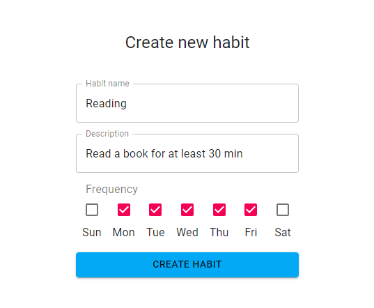
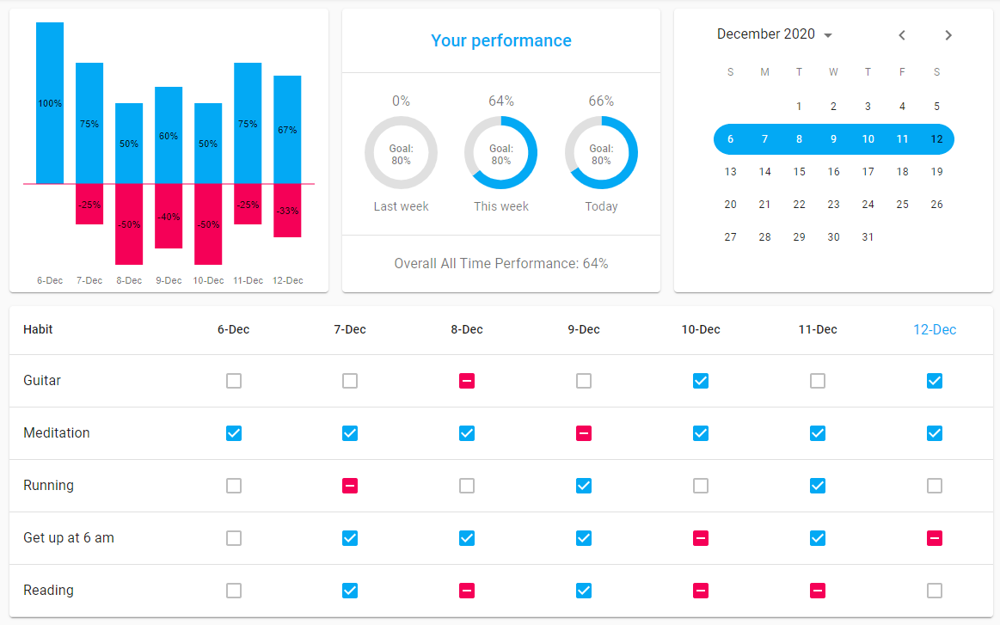

# Habit Tracker

## Table of Contents

* [About](#about)
* [Features and Stack](#features-and-stack)
* [Screenshots](#screenshots)
* [Getting Started](#Getting started)
* [Challenges](#challenges)
* [Create React App](#bootstrapped-with-create-react-app)

## About

**Habit Tracker** is my final project for [CS50's Introduction to Computer Science Course](https://www.edx.org/course/cs50s-introduction-to-computer-science).
What can I say, **Habit Tracker** keeps track of your habits :fireworks: :ok_hand: :tada:

### Video presentation

A short video (2 minutes in length) where I present the project.

[](https://www.youtube.com/watch?v=zIr_d1ZsIGQ)

## Features and Stack

### Features
* create an account with using email and password
* authenticate using Facebook, GitHub or Google
* login as a guest
* add, edit and delete habits
* mark the habits as `completed`, `failed` or `skipped`
* weekly performance is visualized in a bar chart
* brief summary of performance for last week, current week, current day and all time
* customize the app by changing `primary` and `secondary` color
* toggle dark mode
* choose your language: `ES | EN | PL`

### Stack

* React
* React Query
* React Router
* React Hook Form
* Material UI
* Firebase
  * Authentication
  * Realtime Database
  
## Screenshots

* Landing Page


* Sign up using **Facebook**, **GitHub**, **Google** or create a new account using your email address.


* Create new habit



* Manage your habits - preview, edit or delete your habits


* Keep track of your habits in the Dashboard



* Change your settings


* Customize the app the way you want


## Getting started

How to get started and run this project locally.

### Clone repo and install dependencies

```bash
# Clone the repo
git clone https://github.com/sitek94/habit-tracker-app.git

# Install dependencies
cd habit-tracker-app
yarn
```

### Connect Firebase

While you’re waiting for the dependencies to install, you can set up the Firebase.

1. Login to [Firebase](https://console.firebase.google.com/)
2. Create project
3. Create Realtime Database
1. In step 2, check “Start in **test mode”**
4. Authentication > Sign-in method > Sign-in providers, and add the following:
1. Email/Password
2. Google
3. Anonymous
4. (Optional)**:** If you want to add Facebook and/or GitHub, you’ll have to get Client IDs and secrets from these services
5. Go to Project Overview and add a web app
1. You don’t need to run `npm install firebase`, it’s already installed
6. You should see a `firebaseConfig` similar to this:

    ```bash
    const firebaseConfig = {
      apiKey: "<YOUR_API_KEY>",
      authDomain: "<YOUR_AUTH_DOMAIN>",
      databaseURL: "<YOUR_DATABASE_URL>",
      projectId: "<YOUR_PROJECT_ID>",
      storageBucket: "<YOUR_STORAGE_BUCKET>",
      messagingSenderId: "<YOUR_MESSAGING_SENDER_ID>",
      appId: "<YOUR_APP_ID>",
      measurementId: "<YOUR_MEASUREMENT_ID>",
    };
    ```

7. Create `.env.local` file, by duplicating `.env.local.example`, and use config above to fill it out

### Start the app

```bash
# Start development server
yarn start
```

## Challenges

I learned a lot while building the project and for sure I'm going to learn a lot more while maintaining it. 
That's why I want to keep track of the challenges that I've had along the way so that I can reference them in the future.

### Database and data structure

How should I store habit's completion state for each day? Should each habit have an array with the dates 
when it was performed or should I store dates and each date would keep track of the habits that where performed on that day? 

I tried to structure the data so that it is saved and retrieved as easily as possible. To do so I've been following 
[Firebase guidelines](https://firebase.google.com/docs/database/web/structure-data) and in the end came up with the following data structure:

```json
{
    "habits": {
        "user-one": {
            "habit-one": {
                "name": "Reading",
                "description": "Read a book for at least 30 min in the morning",
                "frequency": [0,1,2,3,4]
            }
        }
    },
    "checkmarks": {
        "user-one": {
            "checkmark-id": {
                "habitId": "habit-one",
                "date": "2020-11-11",
                "value": "completed"
            }
        }
    },
    "users": {
        "user-one": {
            "locale": {
                "code": "en-GB"
            },
            "theme": {
                "primaryColor": "blue",
                "secondaryColor": "red",
                "dark": true
            },
            "performanceGoal": 80
        }
    }
}
```

### Authentication Layer

For quite some time I was using Private and Public routes to prevent an authenticated user from accessing the parts of the app available only for logged in user.
It was fine, but I wanted to use a different layout for authenticated users (additional sidebar on the left).

I found the perfect solution in a [blog post by Kent C. Dodds](https://kentcdodds.com/blog/authentication-in-react-applications):

```jsx
function App() {
  const user = useUser();
  return user ? <AuthenticatedApp /> : <UnauthenticatedApp />;
}
```

### Localization and language

I've never before implemented this in an app, and I really wanted to give it a try. My main goal was to give the user an option to change their locale and language.
Although this goal was achieved, the solution is far from ideal. First, I think that it would be better to split these two layers. For example in YouTube one
can open settings and change either Language or Location.

The app should be running at: [http://localhost:3000](http://localhost:3000/)

## Bootstrapped with Create React App

This project was bootstrapped with [Create React App](https://github.com/facebook/create-react-app).

For the detailed description of available scripts see [CRA Documentation](https://create-react-app.dev/docs/available-scripts)
